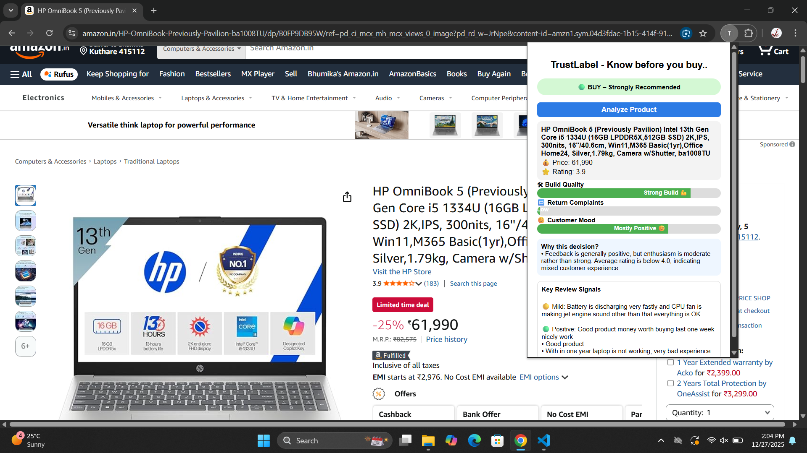
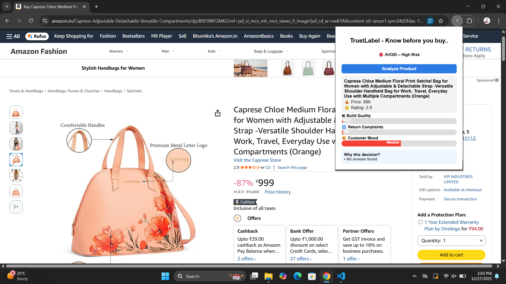

# TrustLabel — Know Before You Buy

TrustLabel is a personal full-stack project that helps users make informed Amazon purchase decisions by analyzing real customer reviews using Natural Language Processing (NLP).

It works as a Chrome Extension that evaluates product reviews and displays a clear decision: **BUY, CAUTION, or AVOID** — along with explainable insights.

---

## 🔍 What Problem It Solves

Online shopping reviews are:

- Time-consuming to read
- Often biased or misleading
- Difficult to convert into a clear decision

TrustLabel transforms unstructured review text into actionable insights.

---

## 🚀 Key Features

- 🧠 NLP-based Sentiment Analysis (Positive / Neutral / Negative)
- 🛠 Build Quality & Durability Detection
- 🔁 Return & Complaint Risk Analysis
- 📊 Decision Badge: BUY / CAUTION / AVOID
- 🧾 Explainable Review Signals
- 🧩 Chrome Extension Interface
- 🕷 Live Amazon Review Scraping (Local Selenium)

---

## 📸 Screenshots

**✅ BUY – Safe Choice**  
Mostly positive reviews with low risk indicators.  


**⚠️ CAUTION – Mixed Signals**  
Moderate durability concerns and some return-related complaints.  


**❌ AVOID – High Risk**  
Negative sentiment with frequent complaints and high return risk.  


---

## 🛠 Tech Stack

**Backend**

- FastAPI (Python)
- Selenium + ChromeDriver
- NLP (Natural Language Processing)
- NLTK (VADER Sentiment Analysis)
- Keyword-based review signal detection

**Frontend**

- Chrome Extension
- HTML, CSS, JavaScript

**Tools**

- Git & GitHub
- Uvicorn
- VS Code

---

## ⚠️ Important Note

Amazon actively blocks scraping from cloud servers.

- ✔ Live scraping works only in local environments using Selenium
- ❌ This project is not intended for production-scale scraping

Built strictly for learning and academic demonstration.

---

## ▶️ How to Run (Local Setup)

### 1️⃣ Backend

```bash
cd backend
pip install -r requirements.txt
python -m uvicorn main:app --reload
